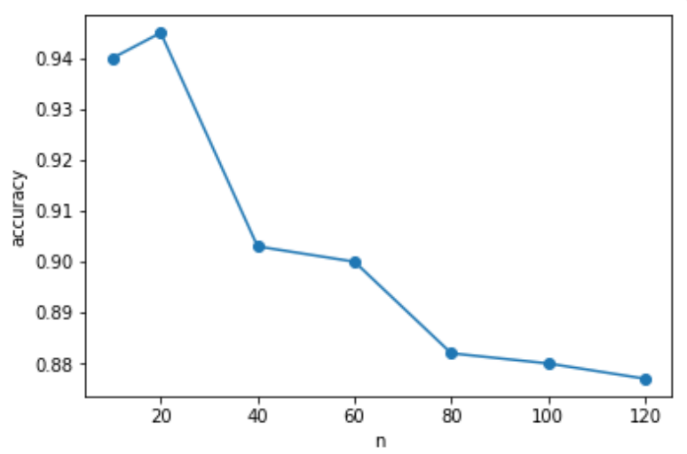

# Face-Recognizer

This repository was contributed by：

1. @HarmoniaLeo: https://github.com/HarmoniaLeo
2. @fyqqyf: https://github.com/fyqqyf
3. @WhereHvaeAllTheFlowerGone: https://github.com/WhereHvaeAllTheFlowerGone

- [Face-Recognizer](#face-recognizer)
  - [Model introduction](#model-introduction)
    - [MTCNN](#mtcnn)
    - [FaceNet](#facenet)
  - [Real-time face detection and recognition system based on **MTCNN** and **FaceNet**](#real-time-face-detection-and-recognition-system-based-on-mtcnn-and-facenet)
  - [Testing on LFW dataset](#testing-on-lfw-dataset)
- [References](#references)

## Model introduction

### MTCNN

Multi-task convolutional neural network (MTCNN) is a network proposed in *Joint Face Detection and Alignment using Multi-task Cascaded Convolutional Networks*[1]. MTCNN adopts cascaded convolutional neural network (CNN) structure, which is able to complete the tasks of face detection and face alignment simultaneously by multi-task learning. It outputs the centroid coordinates, scale and feature point locations of faces. MTCNN adopts image pyramid + 3 stage cascaded CNN (**P-Net**, **R-Net**, **O-Net**) approach for face detection, and its detection framework is shown in Fig.

Image pyramid transforms the image scale to detect the face on different scales. Cascade CNN completes the coarse-to-fine detection of human faces. The output of the former is the input of the latter. It can quickly eliminate the areas that do not contain human faces. For the areas that may contain human faces, it can be handed over to the more complex network behind. More information can be used for further selection, which can greatly improve the selecting efficiency while ensuring the recall rate. The following figure shows three neural networks (P-Net, R-Net and O-Net) connected in MTCNN. The number of network layers of each network layer is gradually deepened, the receptive field of the input image is gradually enlarged, the feature dimension of the final output is also increasing, which means that more and more information is used.

The explanation of the three-level network is as follows:

* **P-Net**: It is actually a Full Convolutional Neural Network (FCN), where the feature map obtained by forward propagation is a 32-dimensional feature vector at each position, which is used to determine whether the area of about 12×12 at each position contains a human face.  The Bounding Box with the highest score is retained and the Bounding Box with too large overlapping area is removed by **NMS** (**Non-maximum suppression**). 
* **R-Net**: It is a simple convolutional neural network (CNN), which refines and selects the input, discards most of the wrong input, and again uses the frame regression and facial feature point locator to perform the frame regression and feature point localization of the face area. Finally, it outputs a more reliable face area for O-Net. Compared with the features of 1132 output by full convolution of P-Net, R-Net uses a full connection layer of 128 after the last convolution layer, which retains more image features and has better accuracy performance than p-net. 
* **O-Net** : It is also a pure convolutional neural network (CNN), which bilinear interpolates the bounding box that R-Net thinks may contain faces to 48 × 48, input to O-Net for face detection and feature point extraction

In the training phase, the three networks will use the key point position as the monitoring signal to guide the learning of the network. However, in the prediction phase, P-Net and R-Net only do face detection, and do not output the key point position. The key point position is only output in O-Net. The output of neural networks at all levels is explained as follows:

* **face classification**: Softmax is used to determine whether it is a face, so the output is two-dimensional. 
* **bounding box regression**: Outputs the offsets of the upper left corner and the lower right corner, so the output is four-dimensional. 
* **facial landmark localization**: Locate the positions of 5 points including left eye, right eye, nose, left mouth corner and right mouth corner, so the output is ten dimensional. 

### FaceNet

FaceNet is a unified framework proposed by Google in *FaceNet: A Unified Embedding for Face Recognition and Clustering* [2] for the problems of recognition (who is this), verification (whether it is the same person), and clustering (finding the same person among multiple faces). FaceNet is a unified framework for recognition (who is this), verification (whether it is the same person), and clustering (finding the same person among multiple faces), etc. FaceNet believes that the above problems can be unified in the feature space, but the difficulty lies in how to better map the face to the feature space. The essence is to learn the mapping of face images to 128-dimensional Euclidean space by convolutional neural network, which maps face images to 128-dimensional feature vectors and uses the inverse of the distance between feature vectors to characterize the similarity between face images. The distances between feature vectors are small for different images of the same individual and large for images of different individuals. Finally, based on the similarity between feature vectors to solve the problems of recognition, verification and clustering of face images, the main process of FaceNet algorithm is: 

* The image is mapped into a 128-dimensional feature space (Euclidean space) by a deep convolutional neural network to obtain the corresponding 128-dimensional feature vector

* L2 regularization of feature vectors to filter out valid features

* Using the regularized feature vectors, compute Triplets Loss

Triplets means ternary, which is different from the two-parameter calculation of neural networks (predicted label and ground-truth), Triplet Loss is calculated by three parameters. Triplets specifically refer to **anchor, positive, and negative**, which are all feature vectors after L2 regularization. Specifically, anchor and positive refer to two matching face thumbnails, where anchor is the base image for model training, positive refers to the image of the same individual as anchor, and negative refers to the image of a different individual from anchor. 

FaceNet uses a deep convolutional neural network to learn the mapping and further designs Triplets Loss to train the network. It is called a triplet because the loss function contains two matching face thumbnails and one non-matching face thumbnail, and the objective is to distinguish positive and negative classes in the sample by distance boundaries. The face thumbnail refers to a cropped image of a face, except for scaling and panning, with no 2D or 3D alignment. The  Triplets Loss function tries to distinguish the face images of different individuals, so that the convolutional network can learn and approximate better better.

The purpose of FaceNet is to embed face images into a 128-dimensional Euclidean space. In the vector space, the distance between an individual feature vector (anchor) and other feature vectors of that individual (positive) is small, and the distance from other individual feature vectors (negative) is large, as shown in the following figure.

Described using mathematical language as: $||f(x_i^a)-f(x_i^p)||_2^2+\alpha<||f(x_i^a)-f(x_i^n)||_2^2,\forall(x_i^a,x_i^p,x_i^n)\in\mathbb R^{128}$

That is, there is a boundary value, such that "the distance between all eigenvectors of any individual", is always smaller than "the distance between any eigenvector of that individual and the eigenvectors of other individuals". Further, Triplets Loss can be defined as: $L_{loss}=\displaystyle\sum_{i}^N[||f(x_i^a)-f(x_i^p)||_2^2-||f(x_i^a)-f(x_i^n)||_2^2+\alpha]_+$, where$[x]_+=\max\{0,x\}$

The choice of Triplets is very important for the convergence of the model. For $x_i^a$, in the actual training, it is necessary to select different pictures $x_i^p$ of the same individual, satisfying $\displaystyle\arg\max_{x_i^p}||f(x_i^a)-f(x_i^p)||_2^2$, and also to select pictures $x_i^n$ of different individuals, satisfying $\displaystyle\arg\min_{x_i^n}||f(x_i^a)-f(x_i^n)||_2^2$

In practical training, it is impractical to calculate both of the above across all training samples, and also makes training convergence difficult due to mislabeled images. Therefore, two methods are commonly used to perform selection: 

* Every $n$ steps, compute the $x_i^p$ and $x_i^n$ of subset.  
* Generate Triplets online, i.e. filter positive/negative samples in each mini-batch. 

This project uses the online generation of Triplets method for selection. 

## Real-time face detection and recognition system based on **MTCNN** and **FaceNet** 

MTCNN is a powerful face feature extractor. We use MTCNN to extract features of images and use FaceNet to map image features to 128-dimensional feature space, and subsequently compare the similarity of faces in the feature space for face detection and recognition. The main flow of the face detection and recognition system is as follows: 

1. Image acquisition from camera using opencv. 
2. Extracting face images from photos by MTCNN face detection model. 
3. Input the face image to FaceNet and calculate the embedding feature vector. 
4. Use knn algorithm to compare the Euclidean distance between feature vectors to determine whether they are the same person and achieve face recognition. 

We have created a simple UI for this project that acquires face videos from the camera, saves the features of the faces in the videos and loads the saved features. Run the `main.py` file to get a dialog box: 

Click "Open camera" to open the camera, at this time the camera detected the face, but failed to identify the face. 

We acquire a face, name the face, and subsequently add the features of the face to the dataset. 

Click "Save dataset" to save the dataset in .npy format.

Afterwards, we click "Load dataset" to load the saved data set to re-run the face recognition. As you can see, the face detection system can now accurately distinguish between different faces.

In addition, the face detection recognition system is able to correctly distinguish faces if multiple faces are present in the camera at the same time. We follow the above steps to add face features to the dataset and then turn on the camera for face detection and recognition.

It can be seen that the face detection recognition system accurately identifies all the faces. 

## Testing on LFW dataset

We additionally tested the algorithm on the LFW (Labled Faces in the Wild) [3] face dataset, which is currently a common test set for face recognition, where the provided face images are derived from natural scenes in life, thus making recognition more difficult. Due to the effects of multiple poses, lighting, expressions, age, occlusions, etc., even the same person's photos are very different. There are 13,233 face images in LFW dataset. Each image is given the corresponding name of a person. There are 5,749 people, most of them have only one picture. The size of each image is 250X250, and most of them are color images.  

In the project directory, the `lfw_funneled` folder contains the LWF image dataset and the `model` contains the network architecture and pre-trained weights for MTCNN and FaceNet. When you need to test on the LWF dataset, you can run the `ctrUi.py` file. 

We selected all datasets with more than two photos of a person in the LWF dataset, and there are 1,681 datasets that meet this condition. We extracted the datasets from the 1,681 datasets in a random form, and a pair of faces was randomly selected from each dataset, one of which was input into the data system and the other was used for the matching test to calculate the test accuracy and test time. The structure of the dataset is shown in the figure below.

In the experiment, we use $n=10,20,40,60,80,120$. For each $n$, we performed 10 experiments and recorded the accuracy and time. Subsequently, we take the average of the 10 experiments as the experimental results. The running time and accuracy tables and curves are plotted as follows.

| n=1  | Accuracy | t(s)/sample |
| ---- | -------- | ----------- |
| 10   | 0.94     | 0.089       |
| 20   | 0.945    | 0.087       |
| 40   | 0.903    | 0.086       |
| 60   | 0.9      | 0.086       |
| 80   | 0.882    | 0.087       |
| 100  | 0.88     | 0.086       |
| 120  | 0.877    | 0.089       |

As shown in the figure, the average accuracy decreases as the value of $n$ increases (except for a slight increase at $n=20$). The highest accuracy at $n=20$ is 0.945, and the lowest accuracy at $n=120$ is 0.877. We speculate that the reason for this phenomenon is that because of the high dimensionality of the FaceNet feature space (128 dimensions), a small deviation will cause the feature vector of the test image to be more offset from its matching vector and close to the feature vector of other images. As $n$ increases, it is more likely to be close to other points after the bias, so the test accuracy decreases as $n$ increases.

# References

[1] Zhang, Kaipeng, et al. "Joint face detection and alignment using multitask cascaded convolutional networks." *IEEE signal processing letters* 23.10 (2016): 1499-1503.

[2] Schroff, Florian, Dmitry Kalenichenko, and James Philbin. "Facenet: A unified embedding for face recognition and clustering." *Proceedings of the IEEE conference on computer vision and pattern recognition*. 2015.

[3] Huang, Gary B., et al. "Labeled faces in the wild: A database forstudying face recognition in unconstrained environments." *Workshop on faces in'Real-Life'Images: detection, alignment, and recognition*. 2008.
